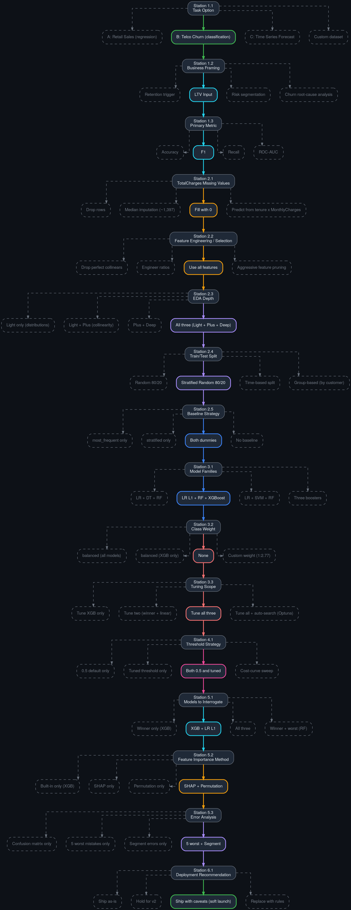

# DS23 Module 3 Assignment 1 - Telco Customer Churn

Supervised learning project for the DS23 course. Binary classification:
predict whether a Telco subscriber will churn, framed as the churn-risk input
to a downstream Customer Lifetime Value (LTV) model.

The full analysis, 8 guiding questions, and reflection live in
[REPORT.md](DS23_Module3_Assignment1_Orarr2/REPORT.md). The notebook
[DS23_Module3_Assignment1_Supervised_Orarr2.ipynb](DS23_Module3_Assignment1_Orarr2/DS23_Module3_Assignment1_Supervised_Orarr2.ipynb)
runs end-to-end and regenerates every number on this page.

---

<details open>
<summary><b>1. Data Card</b> &nbsp;(click to collapse)</summary>

Source: [Kaggle - Telco Customer Churn](https://www.kaggle.com/datasets/blastchar/telco-customer-churn).
Cross-sectional snapshot, one row per customer, no time column.

Shape: <u>7,043 rows x 21 columns</u> &nbsp;|&nbsp; Target: `Churn` (positive
rate = <u>26.5%</u>) &nbsp;|&nbsp; Missing values: 0 (after `TotalCharges`
blank imputation)

## 1.1 Numeric features

| Column | Type | Distribution | Stats | Description |
|---|---|---|---|---|
| **tenure** | int | `█▄▃▃▂▂▂▂▂▂▃▅` | min 0 &middot; mean 32.4 &middot; max 72 | Months as a customer (0-72). U-shaped: many new + many long-tenure. |
| **MonthlyCharges** | float | `█▁▁▃▂▂▄▄▃▄▃▁` | min 18.25 &middot; mean 64.76 &middot; max 118.75 | Current monthly charge in USD. Bimodal (low-tier + high-tier). |
| **TotalCharges** | float | `█▄▂▂▁▁▁▁▁▁▁ ` | min 0 &middot; mean 2279.73 &middot; max 8684.80 | Cumulative charges since signup. Right-skewed. 11 blanks (tenure=0) imputed to 0. |
| **SeniorCitizen** | int | `0: 84% / 1: 16%` | binary | 1 if senior citizen, else 0. |

## 1.2 Categorical features

| Column | Unique | Top values | Description |
|---|---|---|---|
| **gender** | 2 | Male: 50% / Female: 50% | Male / Female. Essentially no churn signal (Cramer's V = 0.008). |
| **Partner** | 2 | No: 52% / Yes: 48% | Has a partner. |
| **Dependents** | 2 | No: 70% / Yes: 30% | Has dependents. |
| **PhoneService** | 2 | Yes: 90% / No: 10% | Has phone service. Near-zero churn signal (V = 0.011). |
| **MultipleLines** | 3 | No: 48% / Yes: 42% / No phone service: 10% | Multiple lines. Perfect dependency with `PhoneService` (V = 1.0). |
| **InternetService** | 3 | Fiber optic: 44% / DSL: 34% / No: 22% | Internet type. Strong driver (V = 0.32). |
| **OnlineSecurity** | 3 | No: 50% / Yes: 29% / No internet: 22% | Strong driver (V = 0.35). |
| **OnlineBackup** | 3 | No: 44% / Yes: 34% / No internet: 22% | Backup add-on. |
| **DeviceProtection** | 3 | No: 44% / Yes: 34% / No internet: 22% | Device protection add-on. |
| **TechSupport** | 3 | No: 49% / Yes: 29% / No internet: 22% | Strong driver (V = 0.34). |
| **StreamingTV** | 3 | No: 40% / Yes: 38% / No internet: 22% | Streaming TV add-on. |
| **StreamingMovies** | 3 | No: 40% / Yes: 39% / No internet: 22% | Streaming movies add-on. |
| **Contract** | 3 | Month-to-month: 55% / Two year: 24% / One year: 21% | <u>Strongest single predictor</u> (V = 0.41). |
| **PaperlessBilling** | 2 | Yes: 59% / No: 41% | Paperless billing. |
| **PaymentMethod** | 4 | Electronic check: 34% / Mailed check: 23% / Bank transfer (auto): 22% | Strong driver (V = 0.30). Electronic check correlates with high churn. |
| **Churn** (target) | 2 | No: 73% / Yes: 27% | <u>Target</u>: did the customer churn last month. |

</details>

---

<details>
<summary><b>2. Decision Tree Card</b> &nbsp;(click to expand)</summary>

The full workflow as a 16-station decision tree. At each station I listed the
options on the table and picked one with a stated rationale - the rejected
options are shown in grey so the choice is visible in context. The full
rendered tree is at the end of section 4.

## 2.1 Chosen path (one line)

`B: Telco Churn (classification)` -> `LTV input` -> `F1` -> `Fill with 0` ->
`Use all features` -> `EDA: Light + Plus + Deep` -> `Stratified Random 80/20` ->
`Both dummy baselines` -> `LR L1 + RF + XGBoost` -> `No class_weight` ->
`Tune all three` -> `Threshold: 0.5 + tuned` -> `Interrogate XGB + LR L1` ->
`SHAP + Permutation` -> `5 worst + Segment errors` -> `Ship with caveats`

## 2.2 Decisions that mattered most

1. <u>Framing as LTV input</u> (station 1.2) - forced the discipline of
   keeping probabilities calibrated, which then ruled out
   `class_weight='balanced'` at station 3.2.
2. <u>F1 over Recall</u> (station 1.3) - acknowledges that FP isn't free
   (every retention offer costs something), even though FN is the bigger
   business risk.
3. <u>Tune all three families</u> (station 3.3) - so "would you ship it?"
   compares each model at its best, not a tuned winner against default
   baselines.
4. <u>Both thresholds in the comparison</u> (station 4.1) - showing 0.5 and
   the F1-tuned threshold side by side makes the precision-recall trade-off
   concrete and readable.
5. <u>Ship with caveats</u> (station 6.1) - balances real delivered value
   (F1 = 0.632, +118% over baseline) against documented risks (24% FN rate,
   ~9 pp senior-citizen FP gap).

</details>

---

<details>
<summary><b>3. Model Card</b> &nbsp;(click to expand)</summary>

## 3.1 Overview

| Field | Value |
|---|---|
| Owner | Orarr2 |
| Task | Binary classification - predict customer churn |
| Business framing | Per-customer churn probability as input to a downstream LTV model |
| Dataset | IBM Telco Customer Churn (Kaggle), 7,043 rows, 21 columns, cross-sectional |
| Target | `1 if Churn == "Yes" else 0` &middot; positive class rate **26.5%** |
| Split | Stratified 80/20 random (5,634 train / 1,409 test) |

## 3.2 What we used

| Family | Algorithm | Tuning | Best params |
|---|---|---|---|
| Linear | LogisticRegression (L1) | `C` over 7 values | `C = 10` |
| Bagging | RandomForestClassifier | 90-cell grid | `max_depth=10, n=500, min_leaf=1` |
| Boosting | XGBClassifier | 135-cell grid | `max_depth=5, lr=0.05, n=100` |

All three share the same `ColumnTransformer` preprocessing (StandardScaler
on numeric, OneHotEncoder with `drop="first"` on categorical). All tuning was
on training folds only; the test set was touched exactly once at evaluation.

## 3.3 Performance (locked test set, sorted by F1)

| Model | F1 | ROC-AUC | Precision | Recall |
|---|---|---|---|---|
| baseline (most_frequent) | 0.000 | 0.500 | - | 0.000 |
| baseline (stratified) | 0.290 | 0.516 | 0.289 | 0.291 |
| LR L1 @ 0.5 | 0.603 | 0.841 | 0.655 | 0.559 |
| RF @ 0.5 | 0.589 | 0.842 | 0.664 | 0.529 |
| XGB @ 0.5 | 0.590 | 0.846 | 0.655 | 0.537 |
| LR L1 @ tuned 0.31 | 0.612 | 0.841 | 0.522 | 0.741 |
| RF @ tuned 0.31 | 0.630 | 0.842 | 0.534 | 0.767 |
| **XGB @ tuned 0.32** | <u>**0.632**</u> | <u>0.846</u> | 0.542 | 0.757 |

Best model: <u>**XGBoost** (tuned, threshold = 0.32)</u>. Beats the
informative stratified baseline by <u>+0.342 F1 (+118% relative)</u>.

## 3.4 What drives it

Top drivers (SHAP and Permutation agree): `tenure`, `Contract`,
`InternetService`, `MonthlyCharges`, `PaymentMethod`, `TotalCharges`. These
line up with the EDA - two-year contracts churn at 2.8%, fiber-optic at 41.9%,
Electronic-check payers at 45.3%. SHAP top-10 and LR L1 top-10 overlap on 7/10.

One coefficient deserves a note: `MonthlyCharges` has a <u>negative</u> L1
coefficient even though churners pay more on average. This is a
multicollinearity artifact - the Fiber-optic dummy absorbs the
"high-charge -> churn" signal (coef +2.49). SHAP and permutation, which handle
correlated features properly, rank `MonthlyCharges` as a <u>positive</u>
driver - the trustworthy answer.

## 3.5 Limitations and failure modes

1. The five most-confident wrong predictions are all <u>FN</u> - long-tenured
   customers on multi-year contracts who churned anyway. The dataset has no
   signal for life events (relocation, divorce, downsize) or competitor offers.
2. Systematic <u>FP on Month-to-month + Fiber + Electronic-check</u>
   customers (FP rate ~30%): the model sees the textbook high-risk profile
   and over-predicts churn on the people who actually stayed.
3. CV F1 std = 0.023. Report the band, never the point.
4. Train-test gap: XGB +0.049 (mild). RF was +0.131 (heavy overfit, not
   shipped despite tying on test F1).

## 3.6 Fairness

| Group | n | Error rate | FN rate | FP rate |
|---|---|---|---|---|
| Female | 687 | 23.4% | 7.3% | 16.2% |
| Male | 722 | 23.4% | 5.7% | 17.7% |
| SeniorCitizen = 0 | 1,187 | <u>22.0%</u> | 6.7% | 15.2% |
| SeniorCitizen = 1 | 222 | <u>31.1%</u> | 5.0% | 26.1% |

Gender: identical 23.4%, no disparity. SeniorCitizen: <u>~9 pp wider FP rate
on seniors</u>. Documented fairness flag - must be monitored in production.

## 3.7 Deployment recommendation

<u>**Ship with caveats (soft launch)**</u>:

1. Phase 1: deploy on high-confidence cases only (`proba > 0.7`).
2. Phase 2: expand after 3 months of monitoring on precision, recall, drift,
   and the SeniorCitizen FP gap.

Monitor weekly: precision, recall, distribution drift on `tenure` /
`MonthlyCharges` / `Contract` / `PaymentMethod`, and the SeniorCitizen FP gap.
Retrain trigger (any sustained for 2 weeks): F1 drop > 0.05, fairness gap >
12 pp, new contract or payment categories appearing.

Next iteration: calibrate probabilities (CalibratedClassifierCV / isotonic)
for the LTV consumer; investigate the SeniorCitizen FP gap slice by slice;
add CS-call counts and complaint history if accessible.

</details>

---

# 4. Files

All submission files live in the
[`DS23_Module3_Assignment1_Orarr2/`](DS23_Module3_Assignment1_Orarr2) folder.

| File | Purpose |
|---|---|
| [DS23_Module3_Assignment1_Supervised_Orarr2.ipynb](DS23_Module3_Assignment1_Orarr2/DS23_Module3_Assignment1_Supervised_Orarr2.ipynb) | Main notebook, runs end-to-end |
| [REPORT.md](DS23_Module3_Assignment1_Orarr2/REPORT.md) | Full report per template (8 guiding questions, model card, reflection) - English |
| [REPORT_he.md](DS23_Module3_Assignment1_Orarr2/REPORT_he.md) | Hebrew version of the report (plain text) |
| `WA_Fn-UseC_-Telco-Customer-Churn.csv` | The dataset (Kaggle Watson Analytics standard mirror) |
| `decision_tree_graphviz.png` | The decision tree image (rendered below) |

## 4.1 Decision tree



---

# 5. How to run

```bash
cd DS23_Module3_Assignment1_Orarr2
pip install pandas numpy scikit-learn xgboost shap matplotlib seaborn python-bidi nbformat jupyter
jupyter notebook DS23_Module3_Assignment1_Supervised_Orarr2.ipynb
# Kernel -> Restart & Run All
```

The first cell auto-installs anything missing, so the `pip install` line is
optional - it just saves the runtime install step.

Run time on a regular laptop: ~6 minutes (most of it spent on GridSearchCV
for the Random Forest).
